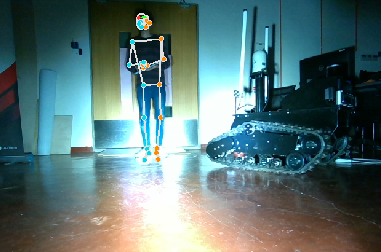

# Human Pose Tracking ROS
This ROS package offers the capability to track human poses in RGB images utilizing the MediaPipe library. The package includes a launch script and a Python script to process images and publishing human pose data.

<p align="center">
	
</p>

## Installation
To use this package, clone the repository into your ROS workspace and build the package.

```txt
mkdir catkin_ws
cd catkin_ws/src
git clone https://github.com/wessamhamid/rgb_pose_tracking_ros.git
```

## Dependencies
This package has the following dependencies:
- ROS (Robot Operating System)
- Python 3.X
- [opencv-python](https://github.com/opencv/opencv-python):
```txt
pip3 install opencv-python==4.2.0.32
```
- [Mediapipe](https://developers.google.com/mediapipe):
```txt
pip3 install mediapipe
```

## Usage
### Launching the RGB Pose Tracking Node
To initiate the RGB pose tracking node, use the provided launch file:
```txt
roslaunch rgb_pose_tracking_ros rgb_pose_tracking.launch
```

<p align="center">
	
</p>

## Details
The launch file (rgb_pose_tracking.launch) activates the `rgb_human_tracking_node`, which subscribes to the `/image` topic, processes RGB images, detects and tracks human poses using the MediaPipe library, and publishes annotated images with human pose information on the `/rgb/human_tracking` topic.

### Subscribed Topics
`/image` (sensor_msgs/Image): RGB images received by the node for pose tracking.
### Published Topics
`/rgb/human_tracking` (sensor_msgs/Image): Annotated RGB images with human pose information.
### Parameters
- min_detection_confidence (default: 0.5): Minimum confidence threshold for landmark detection.
- min_tracking_confidence (default: 0.5): Minimum confidence threshold for landmark tracking.
